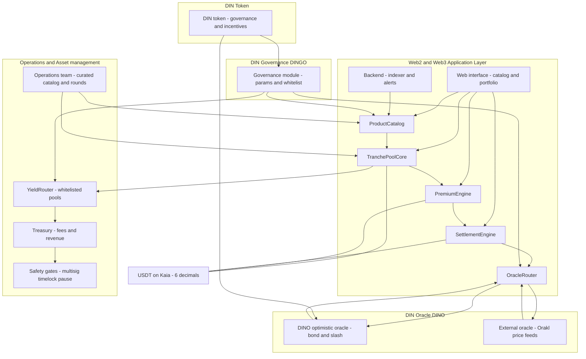

# din-contract
Smart contract of DIN

https://dinsure.app

## Introduction

This repository contains a Hardhat-based smart contract workspace targeting the Kaia Kairos testnet.
It includes the complete DIN protocol modular architecture with sophisticated insurance pool management, oracle-based settlement, and decentralized governance.

## How this works

Modular design with isolated components for scalability and upgradability



- **DinRegistry**: Central configuration hub for the entire protocol
- **TranchePoolCore**: Economics only (orders, collateral, NAV, premiums). Round lifecycle is owned by ProductCatalog.
- **TranchePoolFactory**: Deploy pools per tranche with proper integration
- **SettlementEngine**: Oracle integration + Settlement logic + Dispute handling
- **InsuranceToken**: ERC-721 tokens representing buyer insurance positions
- **ProductCatalog**: Product and tranche management with round lifecycle
- **FeeTreasury**: Protocol fee collection, distribution, and transparent accounting
- **Oracle System**: Dual oracle integration (Orakl Network + DINO optimistic oracle)


## How to run

```bash
npm run compile
npm run test
...
(Create your own deployment scripts and run using hardhat & ignition)
```

## Contract Architecture

**Core Contracts**
- `ProductCatalog`: Single Source of Truth for round states and tranche specifications
- `TranchePoolCore`: Economics-only (orders, collateral, NAV, premiums, auto-refunds)
- `SettlementEngine`: Oracle integration and payout distribution
- `DinRegistry`: Central configuration registry for all contract addresses

**Oracle System**
- `OracleRouter`: Unified interface routing between Orakl Network and DINO Oracle
- `OraklPriceFeed`: External price feeds from Orakl Network (8 decimals)
- `DinoOracle`: Internal optimistic oracle with DIN token governance (8 decimals)

**Decimal Precision**
- `USDT`: 6 decimals (all amounts, premiums, collateral)
- `Oracle Prices`: 8 decimals (both Orakl and DINO)
- `Trigger Prices`: 18 decimals (stored in ProductCatalog, auto-converted for settlement)
- `DIN Token`: 18 decimals (standard ERC20)

## Contract Address

- DinRegistry - `0x029A3a8737f87AA4bFCba746eDe65811C135aA52`
- DinToken - `0x9bDD3B401385a6210590CB15313663898c1c6208`
- DinUSDT - `0xd154254c4be2AF3C92CdaE0c60d08fB554445536`
- FeeTreasury - `0x05FFF34642F2736055A48bD356a02c7DcA7E4446`
- InsuranceToken - `0x4cd06921A17524514223B4e445b83299B5F1eD1a`
- OraklPriceFeed - `0x2FA183Ce51f63fdB905F5787e3570DE336b89DDB`
- ProductCatalog - `0x1eA1611350EAD1f7C99fd70EB50fBf19D2fFC3Ec`
- DinoOracle - `0x263831761BA898A687B9f109461E91f155c7BF43`
- TranchePoolFactory - `0x3877C72aa6bB608F12D15087bDE8e46f307D0aB0`
- YieldRouter - `0x2D2d2C0317f7b09aA51d750a03FB8C6C8cfFc7F8`
- OracleRouter - `0x1EFE5cdf9F7078AfE9480464834A6CEe51E9e3d0`
- SettlementEngine - `0x0c4EdFEe5f2860eB8d8B29fDdcfa317fFF33B49F`
- TestFaucet - `0xc2b80EB3F65042Aedc0140DE20cBD45097cE54eb`

## Prerequisites

- Node.js 18+ and npm
- A Kaia Kairos RPC endpoint
- A funded Kairos testnet account (Kaia Wallet, MetaMask or similar)
