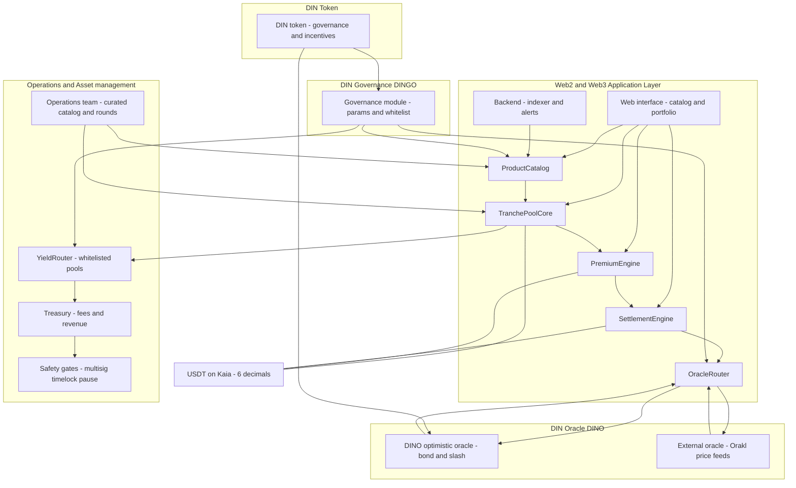
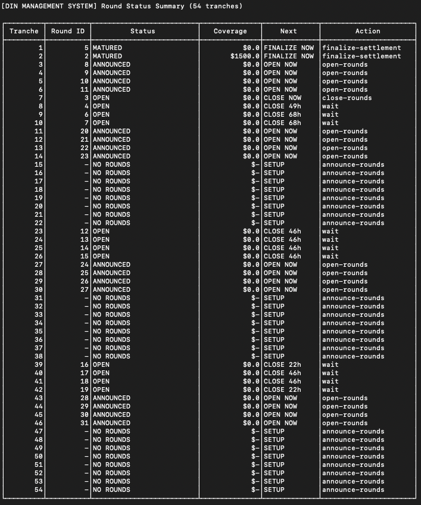

# din-contract
Smart contract of DIN

https://dinsure.app

## Introduction

This repository contains a Hardhat-based smart contract workspace targeting the Kaia Kairos testnet.
It includes the complete DIN protocol modular architecture with sophisticated insurance pool management, oracle-based settlement, and decentralized governance.

## How this works

Modular design with isolated components for scalability and upgradability



- **DinRegistry**: Central configuration hub for the entire protocol
- **TranchePoolCore**: Economics only (orders, collateral, NAV, premiums). Round lifecycle is owned by ProductCatalog.
- **TranchePoolFactory**: Deploy pools per tranche with proper integration
- **SettlementEngine**: Oracle integration + Settlement logic + Dispute handling
- **InsuranceToken**: ERC-721 tokens representing buyer insurance positions
- **ProductCatalog**: Product and tranche management with round lifecycle
- **FeeTreasury**: Protocol fee collection, distribution, and transparent accounting
- **Oracle System**: Dual oracle integration (Orakl Network + DINO optimistic oracle)


## How to run

```bash
npm run compile
npm run test
...
(Create your own deployment scripts and run using hardhat & ignition)
```

## Contract Architecture

**Core Contracts**
- `ProductCatalog`: Single Source of Truth for round states and tranche specifications
- `TranchePoolCore`: Economics-only (orders, collateral, NAV, premiums, auto-refunds)
- `SettlementEngine`: Oracle integration and payout distribution
- `DinRegistry`: Central configuration registry for all contract addresses

**Oracle System**
- `OracleRouter`: Unified interface routing between Orakl Network and DINO Oracle
- `OraklPriceFeed`: External price feeds from Orakl Network (8 decimals)
- `DinoOracle`: Internal optimistic oracle with DIN token governance (8 decimals)

**Decimal Precision**
- `USDT`: 6 decimals (all amounts, premiums, collateral)
- `Oracle Prices`: 8 decimals (both Orakl and DINO)
- `Trigger Prices`: 18 decimals (stored in ProductCatalog, auto-converted for settlement)
- `DIN Token`: 18 decimals (standard ERC20)

## DIN Management System

<figure style="text-align:center;">
  
</figure>

DIN Management System automatically tracks all insuranes and rounds; and decides appropriate actions.

## Contract Address

- DinRegistry - `0x49C56ef6AE40cDCcbF8a4564A320174ac4D2F215`
- DinToken - `0xF38F908DB960B46E43114ed473AC53Ce2f195336`
- DinUSDT - `0x7F1A3aB736b1D8f47126ABcDDF886dAeFfe30916`
- FeeTreasury - `0x327479B3b31012751A57a998eb4B31d597dE0AA9`
- InsuranceToken - `0x03baae944160DcB6B06F20a466FB68Cd09CE3c82`
- OraklPriceFeed - `0xf7b509bfEa5F1e83be7Ea80aa6Eb5bEdF760545F`
- ProductCatalog - `0x780898725199fe45A766dD6Fb950904d0Ae97583`
- DinoOracle - `0xFBdF3Cc16899acBcbe99a9c09466594388A4FcfB`
- TranchePoolFactory - `0x44E0453144D37880Dd29Ef236469A49aA01A87A9`
- YieldRouter - `0xA2bc41830e29AE8752C61e3d7aCF6aE450f030da`
- OracleRouter - `0x1edD6a98c7D2B6aA0B0fAc520BfC201956202eE3`
- SettlementEngine - `0x07401954b3108Ad998d5d57Fd86EBd5c23733bB9`
- TestFaucet - `0x51aFE5dC26834C7902A18fE60E64b21Eb89A397f`

## Prerequisites

- Node.js 18+ and npm
- A Kaia Kairos RPC endpoint
- A funded Kairos testnet account (Kaia Wallet, MetaMask or similar)
